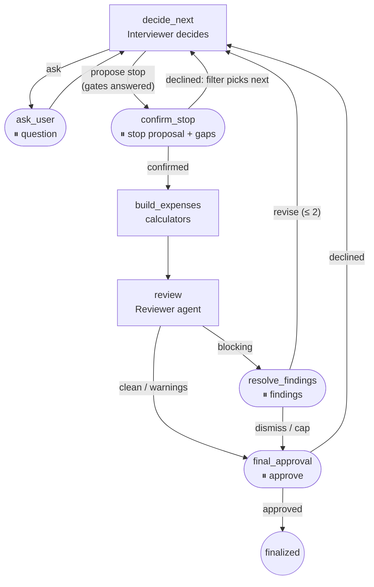
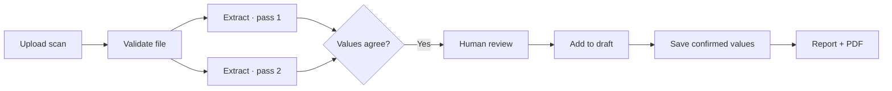
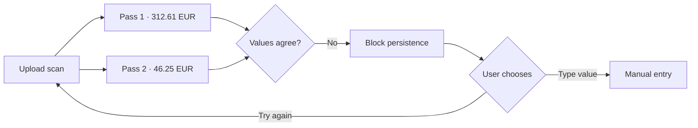
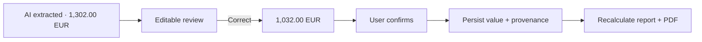

# German Tax Assistant

A workspace that prepares the deductible work expenses (**Werbungskosten**) of a
German employee's tax return — **Anlage N, tax year 2025** — and shows the
reasoning behind every figure it produces: the formula, the substituted values,
the official form line, and where each value came from.

Two agents and a lot of deliberately ordinary code. An **Interviewer** decides
which question to ask next and when to propose stopping; an independent
**Reviewer** audits the finished case without ever seeing the interview. Every
amount is computed by deterministic, unit-tested calculators — an LLM never does
arithmetic here. The claim that the agent beats a fixed questionnaire is
**measured, not asserted**, against ten synthetic profiles and three comparison
arms; the honest result is in [the agent evaluation](./packages/backend/eval/AGENT_EVAL.md).

Alongside the workspace, a **RAG chat** answers free questions about German tax law
out of 53 official Finanzamt documents with inline citations. It demonstrates the
boundary this project is built around: when a cited answer is enough, and when only
an agent will do.

| | |
|---|---|
| showcase | https://showcase.turingcollege.com/project/05f082fb-b129-4501-aee1-ad72176eb2b0 |
| frontend | https://tax-assistant-app.vercel.app |
| backend | https://steuer-klar-assist.onrender.com · [`/docs`](https://steuer-klar-assist.onrender.com/docs) |

A monorepo: Next.js 15 frontend, FastAPI backend, and a shared type package
generated from the backend's own OpenAPI schema.

## What the Capstone built

Sprint 2 built the RAG chat, Sprint 3 the agentic MVP - the Interviewer, the
Reviewer, the case graph and the calculators - and everything in the table below is
the Capstone's.

| | what was built |
|---|---|
| **Document intake, end to end** | The Sprint 3 screen showed a fixture. Now: the file is checked by its bytes, read twice by a vision model in memory, the two readings are compared, disagreement blocks persistence, the user confirms or corrects, and only the values survive. Plus the retention limit for an undecided upload, the two-type allowlist for what may be sent to a model at all, the cost of each read on screen, and a deploy gate that asks the configured model whether it really honours the schema |
| **A figure that can show its whole origin** | Two halves were missing. There was no passage of law beside the amount: now each branch of a calculator names the rule it applied - a desk written off over its useful life cites depreciation, one under 800 EUR cites the low-value rule - and a test checks that quotation against `KB/`, so verification costs nothing per request and cannot be talked into approving a bad citation. And a case reopened later came back as a bare number: the formula, the form line and the backing document were rebuilt from fields nothing had saved. They are now recomputed on the way out, with a test that fails if another one goes missing the same way. |
| **An approval that belongs to a particular figure** | What the user is asked to approve is now a thing of its own - a Tax Position: the category, the amount, what computed it, and the person's decision about it. Each one carries a fingerprint of what it depended on: which facts, which rule version, which calculator version. So correcting the commute from 12 km to 20 takes the approval back to the user rather than leaving a yes attached to an amount nobody said yes to. The final gate asks per position and takes three answers, because without "not sure" the only way to express it is to leave the card alone - which looks exactly like not having read it. |
| **Correcting without replaying** | Any known fact is editable where it is shown and the case recalculates from it. Before this the only way back was undoing the last answer |
| **The export contract** | The Anlage N PDF, with one rule settled: an unapproved case exports as a draft and says so in the margin, and a sheet missing a figure the blank could not take is marked incomplete whichever it is |
| **Privacy and the law** | Zero Data Retention on every provider call including embeddings; the LangSmith redaction set derived from the field catalogue instead of hand-listed; tests that keep identity data out of the interview; the § 2 StBerG wording guard actually called on what a model writes; the AI disclosure before the first answer; case erasure that clears both stores; `/scope` computed from the running build |
| **The knowledge base moved** | Out of Chroma and out of the deploy, into Postgres with pgvector in its own schema, released by hand on its own schedule - with the reason the search stays exact written down alongside the corpus size at which that stops being true |
| **More than one tax year** | Each year's rules in their own file, with a test that fails if a year is edited in place, so a figure cannot move out from under a return that already used it |
| **Fact keys renamed** | Every stored fact keyed by what it means rather than by the category that consumes it, with a migration and both evaluations re-run |
| **Test infrastructure** | A real provider call made impossible from the suite; the integration suite refused any database that does not identify itself as a test database; a schema-version ledger so a database behind the build refuses the routes rather than half-working |
| **The interface** | The final gate reads as a question rather than a pre-set switch; a finished case can be reopened; German terms are translated with the official word beside them; the account menu; Google sign-in |
| **Measurement** | The mandatory re-run after the calculation tool's contract changed, and a separate measurement of what a second return saves |

## Where an agent, where plain code

The design rule, decided before any agent was written
([docs/AGENT_ARCHITECTURE.md](./docs/AGENT_ARCHITECTURE.md)): a function becomes
an agent only if the number and order of its steps cannot be fixed by code in
advance. Fifteen candidate functions were assessed; two passed.

| concern | what it is | why |
|---|---|---|
| choosing the next question, deciding to stop | **agent** (Interviewer) | depends on everything known so far; a fixed decision tree is unreadable at this branching |
| auditing the finished case | **agent** (Reviewer) | whoever built the case is biased towards it; independence is the point |
| calculations | plain code | tax figures must be reproducible; `domain/calculations.py`, unit-tested |
| question wording | catalogue in code ([ADR 0001](./docs/adr/0001-question-catalogue-instead-of-generated-questions.md)) | typed answers, pre-translated, measurable |
| relevance filtering | plain code | deterministic and testable; the agent picks *among* relevant questions |
| validation, form lines, report | plain code | rules are enumerable; the form is a fact, not a judgement |

The agents' autonomy is fenced by code, not by prompt advice: the Interviewer may
only propose stopping — the user confirms — and never before every gate question
is answered; a model that names a question it was not offered falls back to the
deterministic filter; the Reviewer's verdict is validated field by field, and a
provider outage degrades the review to labelled rules-only, never to silence.

## The case graph

LangGraph orchestrates the whole case; every pause is an `interrupt()` with a
typed payload, and a paused interview survives a new session through a Postgres
checkpointer — the tables hold the case, the checkpointer only the paused run
([ADR 0005](./docs/adr/0005-tax-case-lives-in-tables-not-in-the-checkpointer.md)).



With `DEBUG=true` the frontend shows this graph live in a developer panel — the
current node lit up, and whether the last decision came from the model, the
filter, or the gate guard vetoing a premature stop.

## Why LangGraph for document intake

> I did not use LangGraph to perform file upload or document extraction. Those
> operations remain ordinary, independently testable functions. LangGraph
> orchestrates the stateful workflow around them: conditional failure paths,
> two-pass comparison, and mandatory human confirmation. This makes it
> structurally impossible for an AI-extracted value to enter the tax draft
> before the user reviews it, while giving the UI observable progress and a
> safe resume point.

This is the threshold for using a graph here. A simple
`upload → extract → save` handler would not justify LangGraph. The actual intake
branches when validation fails or extraction passes disagree, pauses for a user
decision, and persists only confirmed values. Plain code still owns file checks,
arithmetic validation and database writes; the graph owns state and routing.

The three diagrams below are the acceptance contract for document intake, and the
path they describe is built: the checks, both extraction passes, the disagreement
gate and the mandatory confirmation are in `packages/backend/services/documents/`
and `workflows/document_intake.py`, with the screen behind them live for a
signed-in case. Uploaded bytes are never checkpointed or stored - both passes
happen in memory, the two readings live in the run's checkpoint until the user
decides and no longer, and only confirmed values survive
([ADR 0004](./docs/adr/0004-documents-are-read-then-discarded.md)). What is not
built yet is the model's opinion where the rules cannot decide a category: today
that question goes to the user, because a model's answer is only worth having with
the official passage beside it, which arrives with the Trace work.

### Demo 1 — a good document

Both independent reads agree, the user reviews the result, and only the confirmed
values reach the draft and its recalculated output.



### Demo 2 — extraction passes disagree

Disagreement is a gate, not a confidence percentage. Nothing is saved as a tax
fact until the user supplies trustworthy data.



### Demo 3 — the user corrects the amount

The correction replaces the proposed value before persistence. Provenance records
both stages: AI-extracted and user-confirmed.



## What the measurement says

Three arms on the same ten profiles
([ADR 0009](./docs/adr/0009-the-measurement-has-three-arms.md)): a fixed
questionnaire derived mechanically from the catalogue (35 questions, always), a
deterministic relevance filter (14–26, no model), and the agent.

- Across **two live runs** the agent saved **15 and 14 questions** over the
  filter, and shortened the interview on **5 of 5 and 4 of 5** of the profiles
  that cannot beat the flat allowance (1,230 €). In both runs: **zero
  amount-affecting fields lost and zero wrong stops** - which is the part that
  has to hold every time, and does.
- On the five profiles above the allowance it saved nothing — correctly: every
  remaining question there carries money.
- Two runs rather than one because the second was mandatory, not a retry: the
  calculation tool's contract changed (issue #36), and both runs are kept. Where
  they differ they differ per profile and in both directions, which is what
  run-to-run variability looks like on ten synthetic profiles.
- The Reviewer caught **3 of 3 seeded defects**, including an inflated claim no
  rule can see — only recomputing the expense from the case's own inputs
  exposes it, and the rules-only mode provably misses it.

The first live run looked better (65 questions "saved") and was worse: the agent
had stopped past an unasked gate hiding an 1,800 € category. That run is kept in
the artifacts, the guard that prevents it is code, and the whole story is in
[AGENT_EVAL.md](./packages/backend/eval/AGENT_EVAL.md) — including what these
numbers do not measure.

## What this is not

Stated here as well as on the running build, because a scope a marker has to infer
is a scope the product gets judged on anyway. The live version computes the same
statement from itself at [`/scope`](https://tax-assistant-app.vercel.app/scope) - the
tax years it holds, the forms it fills, the demo's own limits - so the two cannot
drift apart.

The build refuses eight things by name, and each is a decision rather than an
omission:

| | |
|---|---|
| **filing with the Finanzamt** | nothing is submitted. The PDF is a draft the user checks and files themselves, and it says so in its own margin |
| **tax advice** | § 2 StBerG. This prepares figures and shows their basis; it does not tell anybody what their position is, and the wording guard blocks an answer that tries to ([ADR 0014](./docs/adr/0014-rules-written-in-code-carry-their-own-verified-sources.md)) |
| **capital income** | Anlage KAP and its relatives |
| **self-employment** | Anlage S/G. The filer modelled here is employed - one boundary, chosen once ([CONTEXT.md](./CONTEXT.md)) |
| **corporate or non-resident filers** | outside the modelled filer entirely |
| **the Progressionsvorbehalt rate** | the benefit itself is captured; recomputing the rate it triggers is not |
| **joint assessment** | one filer per case |
| **a document archive** | uploads are read and discarded, never stored ([ADR 0004](./docs/adr/0004-documents-are-read-then-discarded.md)) |

One tax year (2025) and one form family (Anlage N). A second year is a matter of
adding files rather than editing the ones already there
([ADR 0008](./docs/adr/0008-everything-year-dependent-lives-in-one-year-keyed-module.md)),
which is the seam being demonstrated - not a second year being claimed.

Two things the Reviewer cannot do, said plainly because the interface says them too:
it cannot search the knowledge base and cannot see the documents it audits. When its
provider is unreachable it falls back to deterministic rules, and the Review screen
says so rather than letting a degraded pass look like an independent second opinion.

## The workspace

Sign-in is a Supabase magic link or Google, and registration and login are the same
action either way. Google exists for a measured reason: the built-in mailer allows
two messages an hour across the whole project, so a classroom testing on the same
afternoon cannot all receive a link, and the Google path sends no email at all.

The OAuth itself is Supabase's, not this project's. The frontend calls
`signInWithOAuth({ provider: "google" })` and the browser leaves; Google returns the
code to Supabase's own callback (`https://<ref>.supabase.co/auth/v1/callback`,
registered in the Google Cloud console), and Supabase - which holds the client id and
secret in its dashboard, not in this repository - exchanges it and issues **its own**
token. So what reaches the backend is the same Supabase JWT a magic link produces,
verified the same way against the project's JWKS: adding Google changed no backend
code at all. The provider has to be switched on in the Supabase dashboard before the
button does anything.
A Tax Case is one user's file for one tax year (unique per pair, enforced by the
database): the interview asks typed questions one at a time with a visible
rationale; the dashboard shows the running total against the flat allowance,
every expense with its expandable calculation trace, and every value with its
**provenance** — an answer, a document, an assumption, or something remembered
from an earlier year. Assumptions exist only where the cautious reading is
obvious, are always marked, and must be confirmed before a report exists
([ADR 0010](./docs/adr/0010-the-system-may-assume-but-never-silently.md)).

A second return is shorter than the first. Three facts are properties of the
person rather than of the tax year — how far they live from work, whether they
drive it, whether the employer provides a desk — and they carry across cases
instead of being asked again. Never a gate question, though: carrying last
year's "no" over would close a whole category in silence. What carries is
offered back on the stop card, which is the one moment after every gate is
answered and before anything is computed, and rejecting a value there reopens
the question ([ADR 0011](./docs/adr/0011-a-second-return-remembers-what-the-year-does-not-change.md)).
The report is a printable page and a Markdown download; figures that belong to
the Hauptvordruck (ALG I, Elterngeld) appear as a block that says exactly that,
never as an Anlage N row.

Approving the report finalizes the case and the tables enforce it, so a position
declined by mistake needed a way back: **Reopen** on the overview and on the report
lifts the lock and deletes the finished run, and the next advance rebuilds the
interview from the tables rather than asking again what is already answered.

Every German tax term is translated and carries the official word beside it, in a
quieter monospaced style - the category is `Work equipment` to read and
`Arbeitsmittel` to quote, because the form and any letter about it use the second.
The product exists to make a German return legible; leaving the officialese
untranslated would defeat that, and dropping it would leave the user unable to match
what they read here with what arrives in the post.

Row level security is on for every table **and** the backend filters by user id
itself — two locks, deliberately: with RLS in force, a forgotten WHERE surfaces
as an empty result in a test rather than as somebody else's salary on a screen
([db/README.md](./packages/backend/db/README.md)). Uploaded documents are read by
a vision model and never stored — only the values the user confirmed
([ADR 0004](./docs/adr/0004-documents-are-read-then-discarded.md)).

## The RAG chat

The `/chat` tab answers free tax questions with citations: hybrid retrieval
(lexical + metadata + semantic) over 775 chunks, a bounded tool loop for
calculations, and injection scans on both ends of the pipeline. Its pipeline,
stage by stage, is documented in
[the backend README](./packages/backend/README.md#the-rag-pipeline); its own
evaluation — 26 golden cases, deterministic checks plus RAGAS, currently **91 of
91** — in [SUMMARY.md](./packages/backend/eval/SUMMARY.md) and
[LIMITATIONS.md](./packages/backend/eval/LIMITATIONS.md). The chat's prompt does
not know about the case on purpose: putting the case into it would make a
different system of the one those numbers were measured on
([ADR 0007](./docs/adr/0007-chat-feeds-the-case-without-owning-it.md)).

### Where the knowledge base lives, and why the search is exact

The 775 chunks sit in Postgres with pgvector, in their own `kb` schema, and the backend
only reads them. They used to be rebuilt inside every backend deploy - 47 files
re-embedded each time into a store on the instance's own disk - so deploys were slow,
nothing survived between them, and a failure while indexing took down a backend that
was otherwise healthy. A knowledge base is now released by running `ingest.py` by hand,
on its own schedule, and can be checked or rolled back without touching the backend
([issue #32](https://github.com/TuringCollegeSubmissions/ekruke-AE.CAP.AFA.1.1/issues/32),
[ADR 0006](./docs/adr/0006-pgvector-after-the-sprint.md)).

**There is deliberately no vector index.** Every similarity search scans all 775 rows
and compares exactly. This is the opposite of what a vector database does by default,
and the reason is the scale we actually have.

An approximate index - HNSW and its relatives - builds a graph of short paths between
vectors in advance and walks it at query time. That is the only way to search millions
of vectors, and the price is that it can walk past the nearest neighbour. Chroma, which
this project used before, offers nothing else. At 775 rows an exact scan is
milliseconds, so the speed the approximation buys is speed we do not need, and the
misses it costs are real: moving to exact search raised one evaluation question's
reference document from rank 5 to rank 1 - a document the approximation had been
stepping over the whole time.

The second reason is measurement. The retrieval evaluation is graded against fixed
cosine thresholds, and an approximate index would put a second source of variance
inside the thing being measured - a score would no longer say only what the retrieval
does. Two indexes exist and both are exact: `pg_trgm` for the substring tier and a
btree on `(tax_year, form_id)` for the metadata filter.

This is a decision with a stated expiry rather than a preference. The corpus size at
which an exact scan stops being free, and what to add when it arrives, are recorded in
[issue #64](https://github.com/TuringCollegeSubmissions/ekruke-AE.CAP.AFA.1.1/issues/64).

## Repository layout

```
.
├── KB/                     # the knowledge base: 53 official documents
├── CONTEXT.md              # the domain glossary — the vocabulary this repo speaks
├── docs/                   # product vision, architecture, decisions, ADRs 0001-0010
├── packages/
│   ├── frontend/           # Next.js 15: chat, login, cases, interview, report
│   ├── backend/
│   │   ├── agents/         # interviewer, reviewer, gap finder, the LangGraph
│   │   ├── domain/         # calculations, fields, questions, tax_years, estimate
│   │   ├── db/             # Supabase schema, connection contract, repository
│   │   ├── eval/           # both evaluations: RAG (Sprint 2) and agent (Sprint 3)
│   │   └── ...             # RAG pipeline, routes, security (Sprint 2)
│   └── shared/             # TS types generated from the OpenAPI schema
└── render.yaml             # Render blueprint for the backend service
```

## Quick start

```bash
npm run setup
```

Then fill `packages/backend/.env` (the walkthrough for every value is in
[db/README.md](./packages/backend/db/README.md)):

```env
OPENROUTER_API_KEY=sk-or-...          # chat + embeddings
DATABASE_URL=postgresql://...         # Supabase session pooler, port 5432
SUPABASE_URL=https://<ref>.supabase.co
SUPABASE_ANON_KEY=...
SUPABASE_JWKS_URL=https://<ref>.supabase.co/auth/v1/.well-known/jwks.json
```

and `packages/frontend/.env.local`:

```env
NEXT_PUBLIC_SUPABASE_URL=https://<ref>.supabase.co
NEXT_PUBLIC_SUPABASE_ANON_KEY=...
```

Apply the migrations in `packages/backend/db/schema/` in order in the Supabase SQL
editor, load the knowledge base into Postgres, start both servers:

```bash
./scripts/ingest-kb.sh    # 47 documents, 775 chunks, into the kb schema
npm run dev
```

Frontend on http://localhost:3000, backend on http://localhost:8000, Swagger on
`/docs`. **Both modes need the database now.** The knowledge base moved out of the
deploy and into Postgres (issue #32), so the chat reads it from there rather than from
a file the deploy built - which is what stopped a deploy rebuilding 775 embeddings
every time, and what lets a knowledge base be released, checked and rolled back
without touching the backend. Without the Supabase variables the workspace screens
still show a labelled demo fixture, which is what the test suite runs against, and the
chat has nothing to search.

**So the thing to look at is the deployed version above, not a clone.** That was
already true of the workspace, which needs credentials no clone has; it is now true of
the chat as well.

## Tests and evaluation

```bash
npm run test:backend        # pytest — 636 tests, offline, no provider calls
npm run test:frontend       # vitest — 148 tests
cd packages/backend
./venv/bin/python -m pytest -m integration   # 92 more, against the real Supabase
python -m eval.baseline     # form vs filter, free
python -m eval.agent_score  # + the live agent  (~$0.47)
python -m eval.review_score # seeded defects    (~$0.02)
```

The offline suites stub every provider and never touch the network. The
integration group exercises what a fake cannot: the row-level-security policies,
the read-only trigger on finalized cases, the database's own constraint that an
assumption must carry its reason, and a graph pause surviving a fresh process on
the real Postgres checkpointer.

## Tech stack

**Frontend** — Next.js 15 (App Router, Turbopack in dev), React 19, TypeScript,
Tailwind CSS v4, shadcn/ui, next-intl (de / en / ru / tr, all four selectable),
supabase-js for auth, mermaid (lazily imported, dev panel only).

**Backend** — FastAPI, Python 3.12, Pydantic v2, LangGraph with the Postgres
checkpointer, LangChain as the provider layer and tool-calling adapter over
OpenRouter, Postgres with pgvector for the knowledge base in its own `kb` schema
([ADR 0006](./docs/adr/0006-pgvector-after-the-sprint.md), issue #32 — Chroma is
gone), psycopg 3, PyJWT against Supabase's JWKS (ES256, no shared secret),
structlog, pytest.

**Models**, all through OpenRouter and all with Zero Data Retention. None of them
does arithmetic: they choose a question, read a document, phrase an answer or call
a function.

| | model | what it does |
|---|---|---|
| Interviewer | `anthropic/claude-haiku-4.5` | picks the next question from the candidate list, proposes stopping |
| Reviewer | `openai/gpt-5.4` | recomputes every claimed expense, runs the validation rules, raises findings. A different vendor on purpose: the independence is structural, not prompted |
| Chat | `anthropic/claude-haiku-4.5` | query analysis, then generation in a bounded tool loop |
| Document intake | `google/gemini-3.7-flash` at `effort: low`, falling back to `x-ai/grok-4.5` | two independent passes over one file, strict schema. Chosen by a measured sweep, not by preference; the fallback is deliberately not a cheaper Gemini ([research](./docs/research/vision-model-for-document-intake.md)) |
| Embeddings | `openai/text-embedding-3-small` | the 775 chunks and every query, necessarily the same model for both |
| Evaluation judge | `openai/gpt-4o` | RAGAS only, never in the product |

## Deployment

| | host | current URL |
|---|---|---|
| frontend | Vercel | https://tax-assistant-app.vercel.app |
| backend | Render | https://steuer-klar-assist.onrender.com |

Both deploy from `main`. The Render free tier spins down when idle: the first
request waits ~50 s, which the frontend turns into a banner and an early wake-up
probe.

**Both product modes are open in production** — the chat and the Tax Case
workspace — against their own Supabase project. The running build says so itself
at [`/api/v1/meta/scope`](https://steuer-klar-assist.onrender.com/api/v1/meta/scope),
which is computed from `domain/tax_years.py` and the settings rather than written
by hand, so this paragraph cannot outlive the deployment that made it true.

A deploy no longer touches the knowledge base. The 775 chunks live in Postgres and
are loaded by `ingest.py` on their own schedule, so a release can be built, checked
and rolled back without recomputing an embedding, and an indexing failure can no
longer take a healthy backend down with it (issue #32).

## Documentation

| | |
|---|---|
| [docs/PRODUCT_VISION.md](./docs/PRODUCT_VISION.md) | what this is becoming, and the KB scale it must survive |
| [docs/AGENT_ARCHITECTURE.md](./docs/AGENT_ARCHITECTURE.md) | the agent/no-agent assessment of every function, and the graph |
| [docs/SPRINT_AGENTIC_MVP.md](./docs/SPRINT_AGENTIC_MVP.md) | scope, work order, hours, the announced fallback order |
| [docs/KNOWN_LIMITATIONS.md](./docs/KNOWN_LIMITATIONS.md) | what is safe for the Sprint review, what must precede the Tax Case production rollout, and the near-term follow-ups |
| [docs/DECISIONS.md](./docs/DECISIONS.md) + [docs/adr/](./docs/adr/) | every decision with its why |
| [CONTEXT.md](./CONTEXT.md) | the glossary: Tax Case, Gate, Provenance, Assumption, Trace… |
| [packages/backend/eval/AGENT_EVAL.md](./packages/backend/eval/AGENT_EVAL.md) | the agent measurement: method, results, what it does not show |
| [packages/backend/eval/SUMMARY.md](./packages/backend/eval/SUMMARY.md) | the RAG evaluation (Sprint 2) |
| [packages/backend/README.md](./packages/backend/README.md) | the RAG pipeline, API, tools, security |
| [packages/backend/db/README.md](./packages/backend/db/README.md) | Supabase setup, the pooler trap, the RLS contract |
