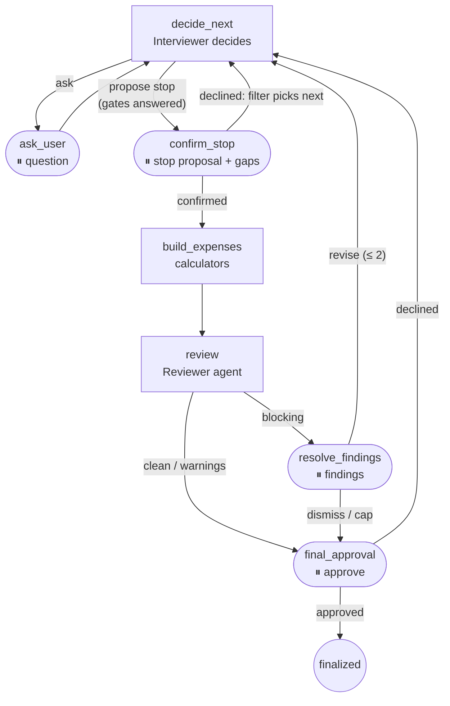

# Agent architecture — where an agent is needed, and where it is not

A living document. Complements PRODUCT_VISION (what we build) and
SPRINT_AGENTIC_MVP (what fits the sprint). This is the boundary between plain
code and agents, and why it sits where it sits.

## Definitions used here

| category | definition | telltale |
|---|---|---|
| plain code | deterministic function, no LLM | unit-testable one-to-one |
| rule-based workflow | fixed steps with if/else | branching is finite and known upfront |
| LLM call | one call, fixed input/output (often structured) | the caller decides when and what next |
| tool calling | LLM picks a tool within one bounded round | no open-ended autonomy |
| one agent | LLM chooses the next step in a loop until done or capped | step count/order not fixed by code |
| multi-agent | several agents with different goals/prompts/context | justified only by role conflict |

"Agent" is not a synonym for "uses an LLM". Most functions below use an LLM and
are not agents. The Sprint 2 pipeline already shows the boundary: query analysis
is an LLM call; generation with `bind_tools` and a 3-round cap is a small,
bounded agent. Sprint 3 widens exactly that existing point of autonomy.

## Assessment of the 15 candidate functions

1. **Create Tax Case** — plain code. Nothing to decide.
2. **Document intake** (upload → type → OCR/parse → store) — rule-based
   dispatch. An "agent" here is pure latency for a decision the MIME type makes.
3. **Extract data from a document** — one LLM call with structured output
   (vision). Failures escalate to the human (HITL), not to agent improvisation.
4. **Classify expenses** — rules first, LLM call with RAG for the ambiguous
   rest. A fixed taxonomy needs no multi-step choice.
5. **Gap finder** — a rule filter (profile → candidate categories) plus one LLM
   call with retrieval to justify. Not an agent itself: a **tool** the
   Interviewer invokes when the state is ready; the *when* is the agentic part.
6. **Choosing the next question (Interviewer)** — **the agent.** The next
   question depends on the profile, the documents, the open fields and the gap
   candidates; a fixed decision tree is unreadable at this branching and dies
   at the next Anlage. Implementation: bounded tool-calling loop with
   `list_open_questions`, `ask_question`, `run_gap_finder`, `run_validation`,
   `request_document`, `conclude_interview`. Question wording comes from the
   catalogue, never the model (ADR 0001); the candidate list is pre-filtered by
   code, or the model re-asks what documents already answered. Round cap 40 —
   derived from the catalogue (the busiest profile legitimately needs 26; the
   original cap of 20 truncated it and scored the truncation as a saving).
   Reaching the cap escalates to the human, never silently stops.
7. **Choosing the calculator** — a dispatch table. The category decided it.
8. **Tax arithmetic** — strictly plain code, unit-tested (`domain/calculations.py`).
   An LLM in the arithmetic is an unverifiable figure on a tax document.
9. **Required-field checks** — plain code (`domain/validation.py`).
10. **Contradiction search** — numeric/logic contradictions are plain code;
    semantic ones (receipt says restaurant, classified as Fortbildung) are one
    LLM call, not an agent.
11. **Expense justification** — one LLM call with retrieval: rule text + expense
    → decision + citation.
12. **Source verification** (does the quote support the claim) — **only for claims a
    model wrote.** A branch of a calculator carries its own passage from the versioned
    rule catalogue (`domain/rule_citations.py`), checked against `KB/` by a test rather
    than by a call at runtime: a test costs nothing per request, answers the same way
    twice, and cannot approve a bad citation. The entailment-style call stays for what
    the model itself formulates — the chat's answers and the model-backed
    classification of an ambiguous invoice (issue #91). See
    [ADR 0014](adr/0014-rules-written-in-code-carry-their-own-verified-sources.md).
13. **Comment generation** — code assembles facts, one LLM call phrases them.
14. **Report rendering** — plain code over already-validated data. **One export
    contract** (#30, ADR 0002): a case the user has not approved exports as a draft
    and says so in the margin of the form, in German, because that is the language of
    whoever picks it up off a printer. Approving the case is what removes the banner -
    with one exception, which is the point of the rule: if any figure could not be
    placed on the blank, the sheet is marked incomplete whether or not the case was
    approved, and the file is named `-draft`. An unmarked tax form missing figures is
    worse than either a marked draft or a complete final one.
15. **Independent case review (Reviewer)** — **the second agent**, justified not
    by "two heads" but by role conflict: whoever built the case is biased toward
    it. Separate adversarial prompt, no access to the interview dialogue — only
    the final state — and tools to recompute and to search the KB. A reviewer
    that can only reread the handed figures would be theatre.

## Conclusion: the minimal justified architecture is two agents

One orchestrating agent (Interviewer) covers the interview, the next-step
choice, and tool invocation. One structurally independent Reviewer covers the
audit. Not five or six "specialised agents": wrapping single LLM calls as agents
adds latency, cost and failure points with no gain. Adding more Anlagen "to
demonstrate multi-agent" scales KB content and taxonomy, not the number of
agents that are actually needed.

## The LangGraph

State is JSON-serialisable throughout (the checkpointer must survive a resume):
ids and dicts, never live objects. Three corrections against the first sketch:
documents carry no `file_ref`/`ocr_text` (files are never stored, ADR 0004);
expenses carry `form_line` (ADR 0002); questions carry no `text` (wording lives
in the catalogue, ADR 0001).

The state describes a **run**, not storage: the case lives in Postgres tables,
the checkpointer holds only a paused run (ADR 0005).

### The built graph

Dashed nodes are the four `interrupt()` points; at each, the state goes to the
checkpointer and the run can resume in another process.

Differences from the earlier sketch: `gap_finder`, `request_document` and
`ingest_document` arrive with the documents step; deterministic validation is
not a node but a Reviewer tool (`run_validation`) plus its degraded mode.

Three guards live in the routing, not in prompts:

- a stop proposal is unavailable until all six gate questions are answered —
  code substitutes the missing gate for a premature conclude;
- after a declined stop the next question is picked by the deterministic
  filter — otherwise the model, seeing the same state, proposes the same stop;
- the revision loop is capped (`MAX_REVISION_ROUNDS = 2`): an unfixed
  contradiction survives every pass, and past the cap the human decides at the
  final gate.

### Human-in-the-loop

`interrupt()` points: answering a question; confirming the Interviewer's stop
proposal (the agent proposes, the human decides); confirming ambiguous
classification/extraction; resolving Reviewer findings; final approval before
the report — the document has tax consequences, the last word is the user's.

### Persistence

The case is stored in ordinary Postgres tables (Supabase) — the source of truth;
the LangGraph checkpointer (key `case_id + user_id`) holds only a paused run
(ADR 0005). The tables are what deliver "expenses and notes kept through the
year". The audit trail of agent decisions is LangSmith, with sensitive values
redacted before upload.

### Long steps

A Reviewer pass takes tens of seconds, so a step never runs inside one HTTP
request: POST returns, progress streams over SSE, polling is the fallback —
nearly free because the run state is already persistent.

### The report

Plain code over validated, commented, cited data: per expense the amount, the
formula with substituted values, the document, the KB citation and the Anlage N
line. Sums that do not belong to Anlage N (Einkommensersatzleistungen) are a
separate block naming the Hauptvordruck.
