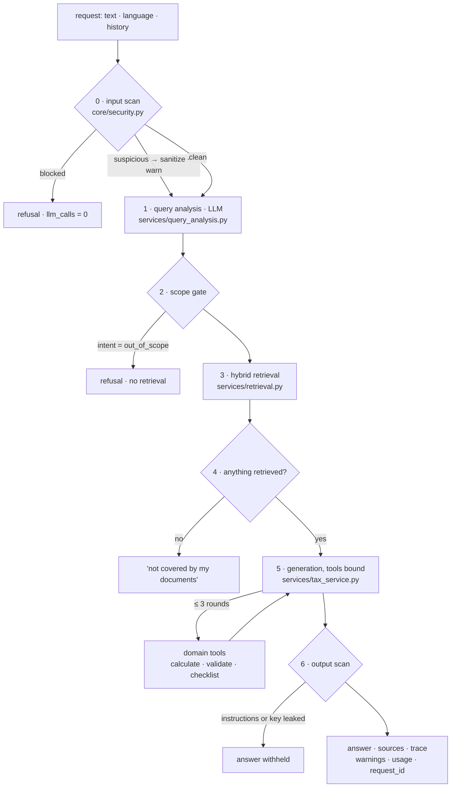
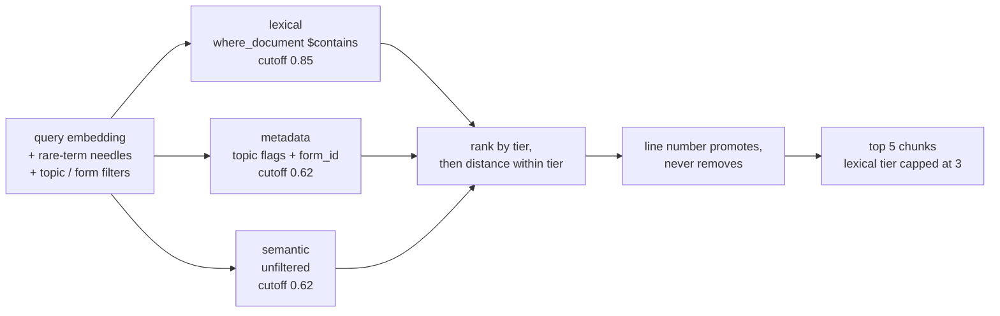

# Backend — FastAPI + RAG pipeline

The question-answering half of the [German Tax Assistant](../../README.md): a FastAPI
service that answers Anlage N questions (employment income, tax year 2025) from the 47
official documents in [`KB/`](../../KB), with inline citations, three calculation tools
and a security scan on both ends.

LangChain reaches OpenRouter for both chat completions (`ChatOpenAI`, with tool calling
and schema-constrained analysis) and embeddings (`OpenAIEmbeddings`); the hybrid retriever,
the tool loop and the security scans stay explicit application stages. See
[Stack](#stack).

## The RAG pipeline

One `POST /api/v1/tax/ask` runs six stages. Four of them can end the request early, and
each early exit exists because the alternative is a confidently wrong answer.



**0 · input scan.** Two tiers. Patterns that a genuine tax question could never contain
("ignore all previous instructions", and its German, Russian and Turkish equivalents)
block the request *before the first provider call* — a guard that refuses after paying is
not doing its job, and the evaluation asserts `llm_calls == 0` on those cases. Merely
structural markers (XML-ish tags, fence delimiters) are neutralised, flagged in the trace,
and the question is answered anyway: that is how an injection is delivered, not proof that
one was attempted.

**1 · query analysis.** One LLM call turns the question — in any of four languages, and
possibly a bare fragment like "74 km" — into an intent, a German search query, up to two
topic filters, an optional Anlage N line number and the language to answer in. The
replayed conversation goes into this call, not just into generation: without it, a
follow-up of "74 km" produces a search query of "74 km" and retrieval returns noise.

The reply is schema-constrained: `QueryPlan` in `services/query_analysis.py` declares the
vocabularies as `Literal` types, which reach the model as JSON-schema enums and reach our
code as validated values. One definition, not a list in the prompt plus a filter after it.
Left free-form, the model invents plausible topics that no document carries — measured:
`["Fahrtkosten", "Werbungskosten", "Anlage N"]`, none of them in the vocabulary.

The stage degrades in two steps rather than failing, because analysis must never break
the pipeline: a reply that misses the schema is re-read leniently — losing the intent and
the search query over one bad topic would be the worse failure — and a reply with no JSON
in it at all becomes a plain knowledge query over the original question.

Two things are worth knowing before extending the schema.

**Keep it to types, enums, `required` and descriptions.** A `ge=1` on the line number
renders as `"minimum": 1`, and Anthropic rejects the whole request with *"For 'integer'
type, property 'minimum' is not supported"* — measured through OpenRouter against
Anthropic, Bedrock and Azure, all three refuse it. Bounds belong in the code that reads
the plan.

**The schema is billed on every question**, so what travels is not what pydantic emits.
`_wire_schema()` strips the per-field `title`, the `default` on every optional field, and
the `anyOf: [{…}, {"type": "null"}]` that a nullable type expresses in a third of the
space; the descriptions are written as instructions to the model, with the reasoning kept
in comments, which cost nothing. Measured on one question: 1352 → 1224 prompt tokens from
the stripping alone, and five mixed questions now average ~1180 against ~1460 before.

The trade this does **not** make is the topic enum. As a free-form string list it costs
32 tokens instead of 204 — and the model then invents topics no document carries, which
is what it did when measured: `["Fahrtkosten", "Werbungskosten", "Anlage N"]`, none of
them in the vocabulary. Abbreviating the values to codes saves less and removes the
meaning the model selects on.

Prompt caching would beat all of this and does not apply here: the prefix is around 1200
tokens and Anthropic's minimum cacheable prefix for Haiku is 2048. Verified rather than
assumed — two identical calls in a row both report `cache_read: 0`.

Against the free-form JSON prompt this replaced, the net is roughly +310 prompt tokens
per question, about $0.0003. What it buys: enums enforced where the tokens are produced,
no regex JSON extraction, and a parse failure that is a typed error rather than a silent
fallback.

**2 · scope gate.** `out_of_scope` is refused here, without retrieval.

**3 · retrieval.** [Below](#retrieval).

**4 · empty retrieval.** No chunk within the distance cutoff means the assistant says so.
This is also the second topic gate: whatever intent came back from stage 1, nothing
outside the knowledge base can be answered from context.

**5 · generation.** The context documents are assembled with their `source_id` as the
citation key and are themselves sanitised — the knowledge base is ours, but it is official
PDFs converted to Markdown, and a chunk carrying a stray delimiter must not be able to
close the prompt block. The question travels inside `<user_question>` tags so the model
can tell data from instructions. Tools are bound; the model may call them for up to three
rounds before producing the final text.

**6 · output scan.** An answer that recites eight or more consecutive words of our own
instructions, or carries something shaped like an API key, is dropped rather than
repaired — there is no way to tell which part of it the leak contaminated.

The response carries a `trace` of exactly these stages, which is what the UI's "how this
was generated" panel renders, plus `usage` (tokens, provider calls, USD estimate) and the
`request_id` that ties the answer to its server-side log line.

### Retrieval

Three strategies run against a **single** embedding of the query; their results are
pooled, so a filter can only ever add candidates.



**Why tiers rather than one sorted pool.** A lexical hit is evidence about *this chunk* —
the term is in it. A topic flag is only evidence about its *document*, which for the
80-chunk § 9 is weak: sorted together by distance, § 9 passages on Einbürgerung and
Werbegeschenke outranked the actual passage on Berufsverbände.

**Why lexical at all.** German questions compound what the sources keep apart. For "Sind
Gewerkschaftsbeiträge absetzbar?" the vectors put pension and insurance contributions on
top and the § 9 union-dues passages did not appear in the first twenty results. Needles
are capitalised prefixes of at least eight characters, and only rare ones count: a needle
matching more than 40 of 775 chunks tells you nothing about which one answers the
question, so it is dropped.

**Why the lexical tier is capped at three.** Rarity is not a bound on how many chunks a
needle contributes, and 40 of 775 is rare while still being eight times `k`. Asked about
Verpflegungspauschalen, the needle `Dienstreis` matched 16 chunks, those 16 took ranks
1–16, and the BMF Reisekosten letter that answers the question — second-nearest chunk in
the entire collection, and second in the metadata tier — landed at rank 18. It was
recorded as a knowledge-base gap that a larger `k` might fix; it was the tier order, and
`k` would have had to reach 18. Capping the tier put it back at rank 5 and took the
deterministic checks from 24/26 to **26/26** at unchanged `k`
([eval/SUMMARY.md](./eval/SUMMARY.md#retrieval-fix-the-lexical-tier-cap)).

**Why `line` only promotes.** It used to be a hard post-filter, and that was the single
biggest defect the evaluation found. The analyzer returned a line number for 12 of 26
questions and in 10 of those it was the same invented line 31, while only 55 of 775 chunks
carry line metadata at all. Filtering discarded every document that answered the question
and kept whichever tagged chunk survived — which is how a question about the commute
allowance came back answered from a document about doppelte Haushaltsführung. Making it
promote instead took authoritative-document retrieval from 5/11 to 10/11. The whole story
is in [eval/SUMMARY.md](./eval/SUMMARY.md).

Footnote-only chunks (`+++ Zur Anwendung vgl. ... +++`) are dropped: they embed close to
everything.

## Project structure

```
packages/backend/
├── main.py                 # FastAPI app, CORS, request-id middleware, error contract
├── ingest.py               # CLI: chunk KB/ → embed → upsert into Chroma
├── browse_chroma.py        # interactive vector-store browser
├── inspect_chroma.py       # one-shot collection dump
├── api/
│   ├── routes/tax.py       # /ask, /feedback, /health
│   └── schemas/tax.py      # request/response models — the source of the OpenAPI schema
├── core/
│   ├── config.py           # pydantic-settings, read from .env
│   ├── dependencies.py     # cached LLM client and retriever, overridable in tests
│   ├── llm.py              # LangChain chat adapter: tool calls + structured output
│   ├── embeddings.py       # LangChain embeddings adapter: batching + retries
│   ├── vectorstore.py      # persistent Chroma collection, cosine space
│   ├── chunking.py         # heading-aware chunking + metadata extraction
│   ├── security.py         # input/output scans, sanitising, PII redaction for logs
│   ├── rate_limit.py       # per-IP and global windows on /ask — the spend cap
│   └── pricing.py          # token counts → USD estimate
├── services/
│   ├── query_analysis.py   # stage 1
│   ├── retrieval.py        # stage 3
│   ├── tax_service.py      # the pipeline itself
│   └── tools.py            # tool definitions + dispatcher
├── domain/                 # pure tax logic — no LLM, no FastAPI
│   ├── calculations.py     # five 2025 calculations
│   ├── validation.py       # plausibility rules and legal caps
│   └── checklist.py        # per-category document checklists
├── tests/                  # 150 pytest tests
├── eval/                   # golden set, deterministic checks, k sweep, RAGAS → eval/README.md
├── requirements.txt        # the app; requirements-dev.txt holds pytest
└── .env.example
```

`domain/` is deliberately free of any LLM or web concern: the amounts and rules are unit
tested directly, and `services/tools.py` generates the tool JSON schemas *from* the domain
Pydantic models, so the contract the model sees cannot drift from what is validated.

## Setup

```bash
cd packages/backend
python3.12 -m venv venv
source venv/bin/activate
pip install -r requirements.txt -r requirements-dev.txt
cp .env.example .env          # then add your OPENROUTER_API_KEY
```

`npm run setup` from the repository root does all of this.

Versions live in the requirements files and nowhere else: `requirements.txt` is the
application and is what `render.yaml` installs, `requirements-dev.txt` adds what only a
developer runs, and `eval/requirements-eval.txt` belongs to its own venv. `pyproject.toml`
carries the pytest configuration and no dependencies - it used to declare a second,
different set of versions that nothing installed (#41).

### Configuration

Read from `.env` by `core/config.py`; the full list is in `.env.example`.

| variable | default | notes |
|---|---|---|
| `OPENROUTER_API_KEY` | — | required; the app will not start without it |
| `OPENROUTER_BASE_URL` | `https://openrouter.ai/api/v1` | |
| `LLM_MODEL` | `anthropic/claude-haiku-4.5` | Sonnet 5 is off the course account's model allowlist, not blocked by a setting; `anthropic/claude-opus-4.7` is the Anthropic model this key permits (`core/config.py`) |
| `REVIEWER_MODEL` | `openai/gpt-5.4` | a different vendor from `LLM_MODEL` on purpose; emptying it collapses the audit onto the Interviewer's model |
| `EMBEDDING_MODEL` | `openai/text-embedding-3-small` | changing it invalidates the store; re-ingest with `--reset` |
| `CHROMA_PATH` | `./data/chroma` | |
| `CHROMA_COLLECTION` | `tax_kb_2025` | |
| `CORS_EXTRA_ORIGINS` | `""` | comma-separated, matched exactly, no trailing slash |
| `RATE_LIMIT_PER_IP` | `10` | requests per client per window on `/ask`; `0` disables |
| `RATE_LIMIT_PER_IP_WINDOW_SECONDS` | `60` | |
| `RATE_LIMIT_GLOBAL` | `240` | requests from everyone per window on `/ask`; `0` disables |
| `RATE_LIMIT_GLOBAL_WINDOW_SECONDS` | `3600` | |
| `TRUST_PROXY_HEADER` | `false` | `true` only behind exactly one trusted proxy — see below |
| `DEBUG` | `false` | `true` → key=value logs and uvicorn reload |
| `LOG_LEVEL` | `INFO` | |
| `API_PORT` | `8000` | |

## Knowledge base

Nothing is answered before the store is built:

```bash
python ingest.py                 # ingest ../../KB into Chroma
python ingest.py --reset         # drop and recreate the collection first
python ingest.py --dry-run       # chunk only: no embedding calls, no writes
python ingest.py --kb-path PATH  # a different KB directory
```

Current contents, as reported by `--dry-run` and the collection itself:

| | |
|---|---|
| documents | 47 Markdown files (EStG/EStH/LStH excerpts, BMF letters, ELSTER Anleitungen) |
| chunks | 775 |
| chunk size | 85 / 1476 / 3024 characters (min / mean / max) |
| topics present | 25 |
| tax year | 2025 |

**Chunking** splits on Markdown headings first — the KB was converted so that legal units
(§§, Anhang sections, R/H blocks) became headings — then packs whole paragraphs to roughly
1200 characters, never breaking one. Oversized paragraphs from PDF extraction are split on
sentence boundaries; a table that will not split becomes its own chunk, which is where the
3024-character maximum comes from. Tails under 200 characters are merged backwards.

**Metadata** per chunk: `source_id`, `title`, `form_id`, `tax_year`, `section` (the
heading path), `line` (any "Zeile 31" mentioned in the text, as CSV) and one boolean flag
per topic. The per-topic flags exist because Chroma metadata values must be scalar: storing
only the first topic left § 9 Werbungskosten — which covers `berufsverbaende` but leads
with `entfernungspauschale` — unreachable by every topic but its first.

The analyzer accepts 26 topic labels; 25 of them occur in the KB. The odd one out is
`belege`, which is served by the checklist tool rather than by documents. A topic filter
matching nothing does not discard the retrieval — it adds a warning to the response.

Browse what was actually stored:

```bash
python browse_chroma.py     # random samples, lookup by source_id, collection stats
python inspect_chroma.py    # non-interactive dump of the first few chunks
```

`browse_chroma.py`'s semantic search embeds the query through `core/embeddings.py`, the
way `services/retrieval.py` does, and searches by vector - so a search costs one
embeddings call. It used to pass `query_texts`, which left Chroma to embed the query with
its bundled 384-dimension MiniLM against a collection of 1536-dimension vectors from
`openai/text-embedding-3-small`, and fail (#41).

## Run

```bash
python main.py                                   # development, reload when DEBUG=true
uvicorn main:app --host 0.0.0.0 --port 8000      # production
```

- Swagger UI — http://localhost:8000/docs
- ReDoc — http://localhost:8000/redoc
- OpenAPI JSON — http://localhost:8000/openapi.json (what `npm run generate-types` reads)

## API

All routes are under `/api/v1/tax`.

### `POST /ask`

```jsonc
{
  "text": "Kann ich mein Arbeitszimmer absetzen?",  // 1–1000 chars
  "language": "auto",                               // auto | en | de | tr | ru
  "context": {},                                    // optional, free-form
  "history": [                                      // ≤ 16 earlier turns, oldest first
    { "role": "user", "text": "..." },
    { "role": "assistant", "text": "..." }
  ]
}
```

```jsonc
{
  "summary": "Markdown answer with inline [source_id] citations",
  "explanation": [],
  "sources": [{ "title": "...", "ref": "...", "url": "",
                "source_id": "...", "section": "...", "snippet": "..." }],
  "intent": "knowledge",
  "trace": [{ "label": "Retrieval", "detail": "5 chunks from 3 documents · lexical:Arbeitszim, semantic" }],
  "warnings": ["..."],                   // pipeline warnings only, not the legal disclaimer
  "tool_results": [{ "tool": "calculate_tax_amount", "data": { } }],
  "usage": { "prompt_tokens": 0, "completion_tokens": 0, "total_tokens": 0,
             "llm_calls": 2, "model": "anthropic/claude-haiku-4.5", "cost_usd": 0.0042 },
  "request_id": "9f3c1a2b4d5e6f70"
}
```

The API is **stateless**: the model knows only what `history` carries, and those turns are
client-supplied and therefore untrusted. They are sanitised individually; a turn carrying
an injection is *dropped* rather than refused, because refusing would wedge the
conversation — the offending text would come back with every following request. When a
user turn goes, the answer that followed it goes with it.

`cost_usd` is `null` when the model is missing from the price table in `core/pricing.py`,
never `0.0`: an unpriced request must not be displayed as a free one.

### `POST /feedback`

```json
{ "request_id": "9f3c1a2b4d5e6f70", "rating": "up", "comment": "optional" }
```

Written to the log against that `request_id`, which is what makes a rating joinable with
the retrieval strategies, tools and token usage of the request it rates. Comments are
redacted before logging — a user explaining a wrong answer will quote their own salary
while doing it.

### `GET /health`

`{"status": "ok"}`. This is the Render health check path, and the frontend's connectivity
probe: it is called on page load, which both tells the user a cold start is under way and
is what wakes the spun-down instance. Deliberately outside the rate limits — it costs
nothing and refusing it would report a healthy backend as unreachable.

### Errors

Every error returns the same shape; internals are logged, never sent:

```json
{ "detail": "human-readable, safe", "error_code": "VALIDATION_ERROR" }
```

| status | code | when |
|---|---|---|
| 422 | `VALIDATION_ERROR` | request fails the Pydantic contract |
| 429 | `RATE_LIMITED` | over a rate limit; carries `Retry-After` in seconds |
| 502 | `LLM_PROVIDER_ERROR` | OpenRouter unreachable or returned an unusable shape |
| 500 | `INTERNAL_ERROR` | anything else |

Validation errors log the location and kind of each problem but never Pydantic's `input`
field — for an over-long question, that field is the whole question, salary included.

## Tools

Three tools, defined in `services/tools.py`, with their JSON schemas generated from the
domain models:

| tool | does | needs |
|---|---|---|
| `calculate_tax_amount` | five 2025 calculations: Entfernungspauschale, Homeoffice-Pauschale, Arbeitsmittel (GWG/AfA), Pauschbetrag comparison, Telefon/Internet | the inputs for that calculation type |
| `validate_tax_data` | checks figures against plausibility rules and hard legal caps (V01–V26) | any subset of the user's numbers |
| `build_document_checklist` | which receipts to keep per expense category (Belegvorhaltepflicht) | one or more categories |

`execute_tool()` never raises. Bad arguments come back as `{"error": ..., "problems": [...]}`
so the model can correct them and retry within its three rounds; a name outside the
allowlist is refused and logged as a security event rather than a typo. The system prompt
forbids doing arithmetic in prose, and the evaluation checks that with
`expected_tool_called`.

Amounts live in `domain/calculations.py` and are sourced from the KB itself
(`lsth-2025-par-9-werbungskosten.md`, the tabellarische Übersicht,
`KB/curated-validation-rules.md`) — 0.30 €/km for the first 20 km and 0.38 € from km 21,
6 €/day home office capped at 1260 €, the 800 € GWG threshold, the 1230 €
Arbeitnehmer-Pauschbetrag.

## Security

| layer | what it does |
|---|---|
| input scan | blocks instruction-override patterns in four languages before any provider call; flags and neutralises merely structural markers |
| delimiting | the question and every replayed user turn travel inside `<user_question>` tags; retrieved context is sanitised too |
| history | poisoned earlier turns are dropped, not refused, so one bad turn cannot wedge a conversation |
| scope | two independent gates — the analyzer's `out_of_scope`, and the fact that an empty retrieval cannot be answered |
| tool allowlist | derived from the tool definitions, so the two cannot drift; oversized argument payloads are rejected unparsed |
| output scan | drops answers that recite the instructions or carry an API-key shape |
| logging | every logged string passes PII redaction: IBANs, tax IDs and Steuernummern, emails, phone numbers and amounts from 1000 € up. Questions are logged as a hash plus a redacted preview, tool arguments as field names without values. Published rates (0,30 €, 6 €) stay readable, because that is what makes a log line useful. |

`tests/test_security.py` covers each of these, including the false-positive side: "kann ich
den Pauschbetrag ignorieren?" must not be blocked.

### Rate limits

`/ask` makes at least two provider calls, so an unlimited public endpoint is a
denial-of-wallet: CORS keeps a browser on another origin out, but nothing stops a `curl`
loop, and the bill is the same either way. `core/rate_limit.py` puts two sliding windows in
front of it, checked before the handler runs so a refused request costs nothing:

| window | default | stops |
|---|---|---|
| per client | 10 / minute | one noisy client; generous enough that a person reading answers never sees it |
| global | 240 / hour | the budget itself — a handful of IPs defeats any per-IP number, so without this the first limit is a speed bump |

Per-IP is checked first, and a refused request is not counted: a client hammering the
endpoint neither extends its own penalty (a throttle, not a ban) nor spends the global
window everyone else shares. The response is a 429 with `Retry-After`; *which* limit
tripped is logged but not returned, since that is a hint about how to tune an attack.

The counters are in memory and therefore per-worker — with N uvicorn workers the effective
limits are N×. That is exact on Render's free plan (one instance, one worker) and the
reason the global window sits well below what the budget can absorb; a multi-instance
deployment wants the counters in Redis behind the same `check()` interface.

`TRUST_PROXY_HEADER` is what makes per-IP counting work behind a proxy, where every request
arrives from the proxy's address. When set, the *rightmost* `X-Forwarded-For` entry is used:
a client can prepend whatever it likes to that header, but the last entry is the one the
proxy appended, i.e. the address it accepted the connection from. Wrong in the safe
direction — if a hop adds an entry of its own, clients collapse into one bucket and the
global limit still holds; the leftmost entry would instead let a client choose its bucket
per request and bypass the limit entirely.

## Observability

structlog, JSON in production and key=value under `DEBUG`. Every request gets an id —
supplied via `X-Request-ID` if it matches `[A-Za-z0-9_-]{1,64}`, generated otherwise —
bound into every line the request writes and echoed back in the response header.

A refused request emits `rate_limited` with the window that tripped, the wait it was told
to observe, and the client as a hash — enough to tell one client from another without
recording who they are.

Each answered question emits exactly one `tax_request` line carrying outcome, latency,
intent, retrieval strategies, chunk and citation counts, tools called, provider calls,
tokens, cost and warning count. That single line is what makes a 👍/👎 on the same
`request_id` worth having.

## Tests

```bash
pytest                                   # 150 tests
pytest tests/test_security.py -v
pip install pytest-cov                   # not in requirements-dev.txt
pytest --cov=core --cov=api --cov=services --cov=domain
```

Nothing here makes a network call: the LLM client and retriever are replaced through
`app.dependency_overrides`, and Chroma is stubbed. Coverage spans chunking, the domain
calculations, the tool layer, both security scans, the rate limits, the error contract,
multi-turn history handling and the routes.

The pipeline as a whole is measured separately — see below.

## Evaluation

`eval/` holds a golden set of 26 questions, deterministic checks that need no judge, a
retrieval-only sweep over `k`, and a RAGAS pass in its own virtual environment. The current
configuration passes 26/26 cases and 91/91 checks.

| | |
|---|---|
| [eval/README.md](./eval/README.md) | how to run it |
| [eval/SUMMARY.md](./eval/SUMMARY.md) | what the numbers are and what they mean |
| [eval/LIMITATIONS.md](./eval/LIMITATIONS.md) | what they cannot tell you |

## Stack

FastAPI · Python 3.12 · Pydantic v2 + pydantic-settings · LangChain `ChatOpenAI` and
`OpenAIEmbeddings` · Chroma · OpenRouter (chat and embeddings) · structlog · pytest.

LangChain is the **provider layer**, not the framework. It occupies two files:

- `core/llm.py` — converts the application's message history to LangChain messages,
  attaches the three tool schemas with `bind_tools`, constrains the analysis reply with
  `with_structured_output`, and normalises `AIMessage` tool calls and token usage back to
  the service contract. `include_raw=True` is deliberate: without it the parsed object
  comes back without token counts and the analysis call disappears from the per-request
  cost.
- `core/embeddings.py` — batching, retries with backoff, and provider errors wrapped in
  our own `LLMError`. It sends text rather than tiktoken ids, so the deploy build does
  not fetch a BPE encoder while embedding the knowledge base.

Everything above that stays explicit, because each part carries measured behaviour:
retrieval pools three strategies and ranks them by tier rather than by fused score, the
tool loop counts rounds and logs each call, and the security scans run outside any
provider call so a blocked question costs nothing. No chains, no LCEL, no agent executor,
no `BaseRetriever` — those would either hide a gate or change a number the evaluation
pins. RAGAS still needs its own environment;
[`eval/requirements-eval.txt`](./eval/requirements-eval.txt) explains why.
