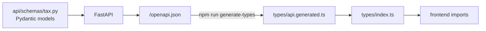

# Shared — `@tax-assistant/shared`

The type boundary between the two halves of the [German Tax Assistant](../../README.md).
It contains no hand-written types: everything is generated from the backend's own OpenAPI
schema, so a Pydantic model and the frontend's idea of it cannot silently diverge.

```typescript
import type { TaxQuestion, TaxAnswer, Source } from "@tax-assistant/shared/types";
```

## Layout

```
packages/shared/
├── package.json          # workspace package, exports ./types
└── types/
    ├── index.ts          # the hand-written surface: named re-exports
    └── api.generated.ts  # generated — do not edit
```

`index.ts` is the only file here written by a person. It gives the generated
`components["schemas"][…]` shapes the friendly names the frontend imports, so a change in
how `openapi-typescript` nests things does not ripple through the app.

## Regenerating



With the backend running on `http://localhost:8000`:

```bash
npm run generate-types
```

The script lives in the frontend package (`openapi-typescript http://localhost:8000/openapi.json
-o ../shared/types/api.generated.ts`) and is re-exported from the root `package.json`.

**Run it when** you add or change an API route, or change a request/response model.
**Don't bother when** you change frontend UI only, or backend logic that leaves the schema
untouched. It is an occasional operation, not a per-session one.

## Never edit `api.generated.ts`

It is overwritten on every run. To change a type:

1. change the Pydantic model in [`packages/backend/api/schemas/tax.py`](../backend/api/schemas/tax.py)
2. restart the backend and run `npm run generate-types`
3. if the change adds a name the frontend should import, re-export it from `types/index.ts`

A generated type that no longer matches the backend usually means step 2 was run against a
stale server.

## Related

| | |
|---|---|
| [packages/backend/README.md](../backend/README.md#api) | the API this schema describes |
| [packages/frontend/README.md](../frontend/README.md#types) | who consumes these types |
